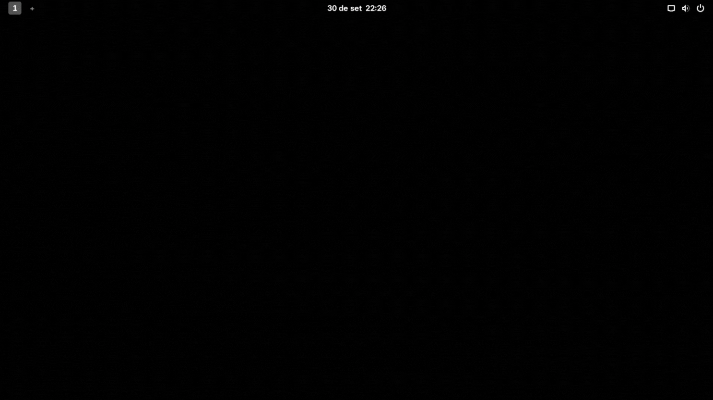
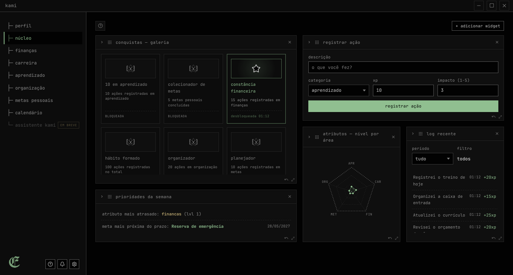
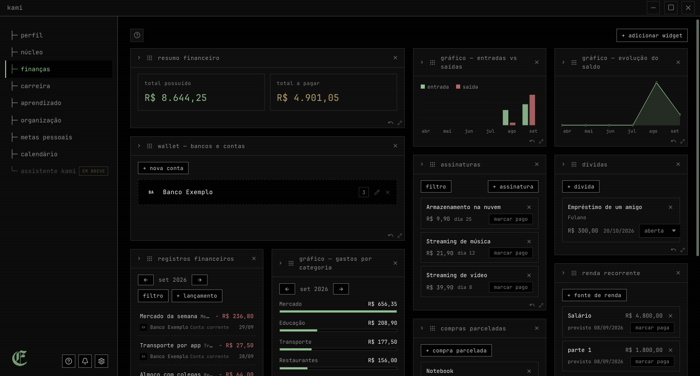
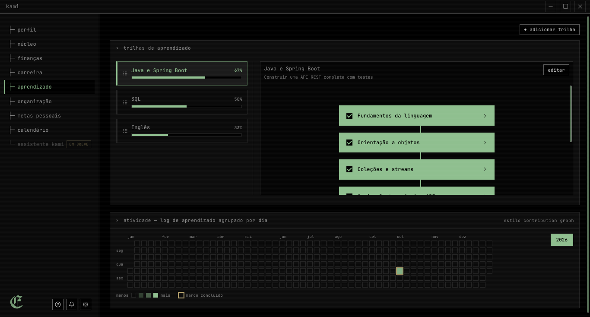
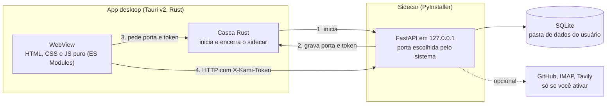

<div align="center">

# Kami

**Um app de produtividade pessoal, local-first, que transforma organização de vida em um jogo.**
Carreira, finanças, estudos e metas num só lugar, com os dados no seu computador.

[](https://github.com/emanuel-frs/KAMI/actions/workflows/smoke-test.yml)
[](https://github.com/emanuel-frs/KAMI/releases/latest)


**[⬇ Baixar](https://github.com/emanuel-frs/KAMI/releases/latest)** ·
**[Guia de instalação](./docs/INSTALACAO.md)** ·
**[Relatar problema ou dar feedback](https://github.com/emanuel-frs/KAMI/issues/new/choose)**



---

</div>

> **English:** Kami is a local-first desktop app (Tauri v2 + FastAPI + SQLite, with a
> vanilla JavaScript frontend) that tracks career, finances, learning and goals as a game with XP and
> levels. Your data stays in a local SQLite file; the app only goes online when you enable an
> integration. Windows and Linux builds are available. The UI is in Brazilian Portuguese.
> Source-available, not open source (see [LICENSE](./LICENSE)).

---

## O que é e para quem é

Eu tinha informação pessoal espalhada em anotações soltas, planilhas, e-mails e memória, sem nenhuma
visão consolidada de carreira, finanças, aprendizado e metas. O Kami junta isso num app só e usa uma
ideia simples para dar motivo de voltar: cada ação registrada (um gasto lançado, um módulo de estudo
concluído, uma meta que avançou) gera XP em um de cinco atributos de vida, sobe de nível e libera
conquistas.

O visual é uma homenagem a terminais antigos: preto, branco, cinza e uma única cor de destaque,
configurável.

**Para quem é:** quem gosta de ferramentas locais, que não exigem conta nem assinatura, e se sente à
vontade com uma interface em português e feriados do Brasil. **Quem não vai gostar:** quem precisa de
macOS, de sincronização entre dispositivos ou de aplicativo para celular, que não existem.

Projeto pessoal, mantido por uma pessoa. Foi feito para o meu uso e publicado como portfólio.

| Núcleo | Finanças | Aprendizado |
|---|---|---|
|  |  |  |

## Funcionalidades

- **Núcleo:** os cinco atributos de vida (Carreira, Finanças, Aprendizado, Organização e Metas), cada
  um com XP e nível, log filtrável de tudo que foi registrado, conquistas automáticas e um painel de
  widgets que você arruma como quiser.
- **Finanças e Wallet:** renda recorrente com cálculo de dia útil (calendário brasileiro), contas
  fixas, dívidas, assinaturas, compras parceladas, cartões de crédito, lançamentos por categoria e
  visão mensal com comparação com o mês anterior.
- **Aprendizado:** trilhas de estudo com marcos, progresso automático, roadmap reordenável e heatmap de
  atividade.
- **Metas pessoais:** tipos como financeira, saúde, leitura, hábito, aprendizado e acadêmica, com um peso
  que multiplica o XP. Uma meta financeira pode debitar de uma conta real do Wallet.
- **Organização:** links categorizados, status dos seus repositórios do GitHub, e-mail por IMAP
  (texto puro, sem HTML de terceiros) e busca na web opcional.
- **Carreira e Calendário:** linha do tempo de posições, formação e histórico salarial; calendário
  mensal que reúne contas, dívidas, parcelas, metas e eventos próprios.
- **Perfil:** avatar em ASCII gerado no próprio app a partir de uma foto; só o texto é salvo, a foto não.

Hoje o Kami **não usa inteligência artificial**. O "assistente Kami" que aparece na barra lateral
está marcado como "em breve" e ainda não faz nada.

## Instalar

Baixe o instalador na [página de Releases](https://github.com/emanuel-frs/KAMI/releases/latest) e
confira o `SHA256SUMS` publicado junto. Detalhes completos, desinstalação e onde ficam os dados estão em
[docs/INSTALACAO.md](./docs/INSTALACAO.md).

| Sistema | Como |
|---|---|
| **Windows (64 bits)** | Baixe `kami-<versão>-windows-x64-setup.exe` e execute. Instala só para o seu usuário, sem pedir administrador. Veja o aviso abaixo. |
| **Debian, Ubuntu e derivados** | `.deb` da Release, ou `sh scripts/install.sh` |
| **Fedora, RHEL e derivados** | `.rpm` da Release, ou `sh scripts/install.sh` |
| **Arch e derivados** | `PKGBUILD` da Release (usa `makepkg`), ou `sh scripts/install.sh` |
| **Outras distribuições** | `.AppImage` |
| **macOS** | Não suportado ainda |

### ⚠ O instalador do Windows não é assinado

Assinatura de código para Windows é paga e o Kami é um projeto pessoal, então o instalador **não é
assinado**. Na prática, o SmartScreen ou o Defender podem mostrar "editor desconhecido" ou até avisar
que o arquivo pode ser malicioso. Isso é comum em programas novos e sem assinatura, e este também embute
um backend em Python empacotado com PyInstaller, formato que antivírus às vezes marcam por engano.
**O aviso não prova que o arquivo é seguro nem que é perigoso.** Confira a origem antes de confiar:

1. baixe só da página de Releases deste repositório;
2. compare o hash com o do `SHA256SUMS` (`Get-FileHash <arquivo> -Algorithm SHA256`);
3. se quiser, envie o arquivo ao VirusTotal;
4. o código está aqui e o instalador é gerado pelo workflow público
   [`release.yml`](./.github/workflows/release.yml).

Passo a passo do SmartScreen, do Defender e do Smart App Control em
[docs/INSTALACAO.md](./docs/INSTALACAO.md#windows-sem-assinatura).

**Outras limitações:** sem atualização automática (baixe a nova Release), interface só em português e
feriados do Brasil.

## Privacidade: o que sai da sua máquina

Seus dados ficam num banco SQLite local. O app só acessa a internet quando você ativa uma integração.
Sem isso, nada sai do computador. Não há telemetria nem conta de usuário.

| Destino | Quando | O que é enviado |
|---|---|---|
| `api.github.com` | só se você cadastrar um repositório ou token | nomes de repositórios e o token (no header) |
| Seu provedor de e-mail (IMAP) | só se você cadastrar uma conta | usuário e senha de app, por conexão SSL |
| `api.tavily.com` | só se você cadastrar uma chave de busca | suas buscas e a chave |
| `duckduckgo.com` | só ao clicar em "abrir busca" | a busca, aberta no navegador |
| Microsoft (Windows) | só na instalação, se faltar o WebView2 | download do runtime |

Senhas de app e tokens ficam cifrados no banco, com uma chave guardada na mesma pasta de dados. Isso
evita segredo em texto puro, mas **não substitui um cofre de senhas** e não protege contra outro
programa rodando com o seu usuário.

## Como funciona por dentro



O frontend é HTML, CSS e JavaScript puro com módulos ES e sem bundler. O backend é FastAPI com SQLite e
vira um executável único com PyInstaller, que o Tauri embute como *sidecar*. A cada execução o sidecar
escolhe uma porta livre em `127.0.0.1` e gera um token aleatório; só o app, que lê esses dois valores de
arquivos na pasta de dados, consegue usar a API.

## Decisões técnicas e o que aprendi

**"Funciona na minha máquina" não é "funciona na máquina de outra pessoa".** O primeiro instalador do
Windows abria o app, mas o backend embutido morria em silêncio: sem console, o PyInstaller deixa
`stdout` e `stderr` nulos e o uvicorn quebrava ao configurar o log. Ainda por cima, a porta era publicada
*antes* de o servidor estar de pé. A correção foi gravar logs em arquivo, publicar a porta só depois da
inicialização, mostrar na tela o motivo da falha com o caminho do log, e instalar o app em máquinas limpas
de Windows, Debian, Fedora e Arch a cada envio ao repositório, pelo CI.

**Uma API em `localhost` não é segura só por isso.** O backend escuta apenas em `127.0.0.1`, mas o CORS
estava aberto e a API tem rotas como o export completo dos dados. Qualquer página aberta no navegador
poderia varrer portas locais e usá-las. Tentei restringir pela origem da requisição e isso quebrou o app,
porque a origem real do Tauri não era a documentada. A solução foi não depender da origem: um token de
sessão por execução, que uma página web não consegue obter. Os testes do sidecar em Linux conferem que a
API responde `401` sem ele.

**Promessas de privacidade precisam bater com o código.** Ao revisar, descobri que o app ainda pedia o
ícone de cada link salvo a um serviço do Google. Troquei por uma inicial local, e a tabela acima descreve
só o que realmente sai da máquina.

**Sem framework nem bundler no frontend.** Foi uma escolha de simplicidade e de aprender a plataforma, e
tem custo: alguns arquivos ficaram grandes (veja o roadmap).

## Problemas conhecidos e roadmap

Sem datas nem promessas; é o que eu faria em seguida.

- **Windows:** assinatura de código (hoje o aviso do SmartScreen aparece) e testar em mais
  configurações de Defender e Smart App Control. O CI valida instalação e backend, mas não o
  comportamento do antivírus de cada PC.
- **Mais plataformas e atualização:** macOS e atualização automática.
- **Segredos:** guardar a chave de cifragem no cofre do sistema (Credential Manager ou Secret Service).
- **Datas e fuso horário:** alguns registros usam UTC e outros o horário local, o que pode contar uma ação
  feita à noite como do dia seguinte perto da meia-noite. Ainda preciso confirmar o efeito real em
  sequências e gráficos.
- **Ícones dos links:** guardar o ícone localmente ao salvar o link, em vez da inicial.
- **Qualidade de código:** quebrar arquivos grandes (`aprendizado.js`, `organizacao.py`) e trocar o
  `datetime.utcnow()` depreciado.
- **Distribuição:** PyInstaller em modo pasta (reduz falsos positivos), publicação no AUR e em outros
  repositórios. Veja [docs/ROADMAP-INSTALACAO.md](./docs/ROADMAP-INSTALACAO.md).

## Licença e contribuição

Código **visível, mas não open source**. Você pode ler o código, instalar e usar o Kami para fins
pessoais, mas não pode redistribuí-lo, publicar cópias como outro produto nem usá-lo comercialmente sem
autorização. Texto completo em [LICENSE](./LICENSE).

Feedback é bem-vindo: [abra uma issue](https://github.com/emanuel-frs/KAMI/issues/new/choose) contando o
que funcionou, o que travou e em que sistema. Pull requests podem ser recusados, e o
[LICENSE](./LICENSE) explica o que acontece com contribuições. Problemas de segurança:
[SECURITY.md](./SECURITY.md).

## Para desenvolvedores

<details>
<summary>Rodar a partir do código-fonte, testes e build</summary>

### Requisitos

- Python 3.11 ou superior (o CI usa 3.11)
- Node.js 22 (só para os testes do frontend)
- Rust e a Tauri CLI (`cargo install tauri-cli --version "^2" --locked`), só para o modo desktop
- Dependências de sistema do Tauri no Linux: veja [tauri.app/start/prerequisites](https://tauri.app/start/prerequisites/)

### Backend

```bash
cd backend
python3 -m venv .venv
source .venv/bin/activate
pip install -r requirements.txt
uvicorn app.main:app --reload --port 8000
```

Cria `backend/kami.db` na primeira execução. Documentação interativa em `http://127.0.0.1:8000/docs`.
Neste modo não há token de sessão; ele só existe no backend empacotado.

### Frontend

Desktop, com o backend rodando (`KAMI_DEV_NO_SIDECAR=1` evita subir o sidecar empacotado):

```bash
cd src-tauri
KAMI_DEV_NO_SIDECAR=1 cargo tauri dev
```

Web, servindo os módulos ES (não abra o arquivo direto):

```bash
cd frontend
python3 -m http.server 5500
```

Atenção: `cargo tauri dev` sem essa variável usa o binário do sidecar que já está em
`src-tauri/binaries/`. Se ele for antigo, o app mostra erro ao iniciar. Reconstrua com `./build.sh`.

### Modo demo (dados fictícios)

Para gravar telas ou testar sem tocar nos seus dados:

```bash
cd backend
KAMI_DATA_DIR=/tmp/kami-demo uvicorn app.main:app --port 8000

# em outro terminal, na raiz do repositório
python3 scripts/seed_demo.py
```

O seed se recusa a rodar numa instância que já tem dados. E-mail e GitHub ficam vazios no demo, porque
dependem de credenciais.

### Testes

```bash
cd backend && pytest     # backend
npm install && npm test  # frontend (runner nativo do Node)
```

### Build de produção

```bash
cd backend && source .venv/bin/activate && pip install pyinstaller
./build.sh               # na raiz: sidecar + instaladores em src-tauri/target/release/bundle/
```

No Windows o build precisa rodar numa máquina Windows (sem cross-compile) com Python, Rust, a Tauri CLI
e Git Bash. A versão vive em `VERSION`; use `scripts/bump-version.sh` em vez de editá-la à mão.

### Publicar uma release

A versão vive em `VERSION`. O workflow
[`release.yml`](./.github/workflows/release.yml) gera os instaladores para Windows e
Linux, publica os checksums e cria a GitHub Release quando recebe uma tag `v*.*.*`.

### Estrutura

```
backend/      FastAPI, SQLite, testes e entrypoint do sidecar (run_server.py)
frontend/     HTML, CSS e JS puro: pages/, widgets/, modals/, api/
src-tauri/    casca desktop (Rust, Tauri v2)
scripts/      instalação, versão, seed do modo demo e testes de CI
docs/         guia de instalação, roadmap e página de download
```

</details>

---

<div align="center">

Feito por **Emanuel** ([@emanuel-frs](https://github.com/emanuel-frs)) · ([LinkedIn](https://www.linkedin.com/in/emanuel-f-2565181b6/))

</div>
